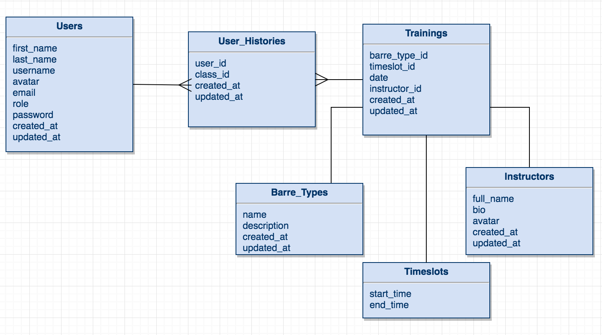

# Barre Better
[ ](https://app.codeship.com/projects/198912)[](https://coveralls.io/github/jaclynjessup/Barre_Better)[](https://codeclimate.com/github/jaclynjessup/Barre_Better)

## Description
Barre Better serves the avid barre enthusiast. As a client of Barre Better one can log into their account and reserve their spot at the barre. Then view their class history through several data visualization tools. As an instructor of Barre Better one can create, update, or delete a class for the studios schedule. They can also see who is enrolled in their class and see their class history as well. Clients who are new to the barre style workouts can view an interactive image explaining the five barre essentials.

The project uses the following libraries and frameworks:
* Ruby on Rails
* Google Charts
* Chartkick
* React.js
* Foundation

## Demo
For a live demo of the site, please visit: [BarreBetter](http://barre-better.herokuapp.com/)

## ER Diagram


## Challenges Faced
* SVG image incorporated into React.js
* Charts displaying data from join tables
* Charts displaying data from range of User History
* Building 3 different interfaces: Client, Instructor, & Admin

## Setup
The app uses Ruby 2.2.5 and was developed on Ruby on Rails 5.0.0.1.  React is served up
in Node.js using webpack 2.2.1.

To install, please run the following in your terminal:

### Set up Rails
```
git clone https://github.com/jaclynjessup/Barre_Better.git
cd book_expedition
bundle install
rake db:create
rake db:migrate
```

### Set up Webpack
`npm install`

## Running the application
To run BarreBetter, please run the following commands in your terminal from the
`barre_better` directory:

```
rails s
npm start
```

Now open your browser and enter `localhost:3000` in your address bar.

## Testing
To run the test suite, please enter the following command from the `barre_better`
root directory:

`rspec`
